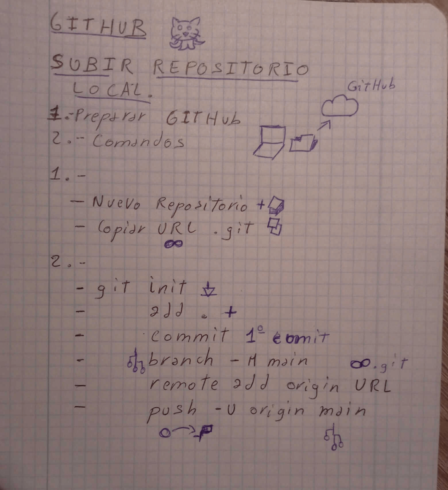

# GitHub

Concepto    |   Definición          | Codigo
git         |   Llama a gitHub      |   git
add
"."
commit
push
origin
main

## Subir archivos

# Previsualizar en markdown en vscode
ctrl + shift + v

## Subir repositorio nuevo
;

PNG: Capturas con texto.
JPG: Imágenes.

# Git Errores
Error: 007 - push rechazado por email privado
Solución (comandos): 