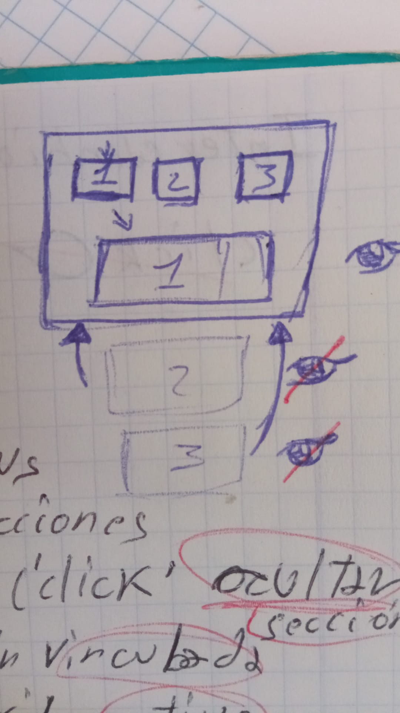
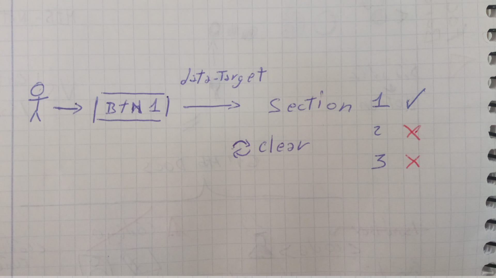

# Lógica: SWAP SECTIONS
Navega entre secciones.
Cada botón muestra una sola sección.
## Imagen de contexto
;

## Diagrama de comportamiento.
;

## Stack
- HTML
- CSS
- JS

## Trucos:
**data-target** para vincular botones y secciones.
