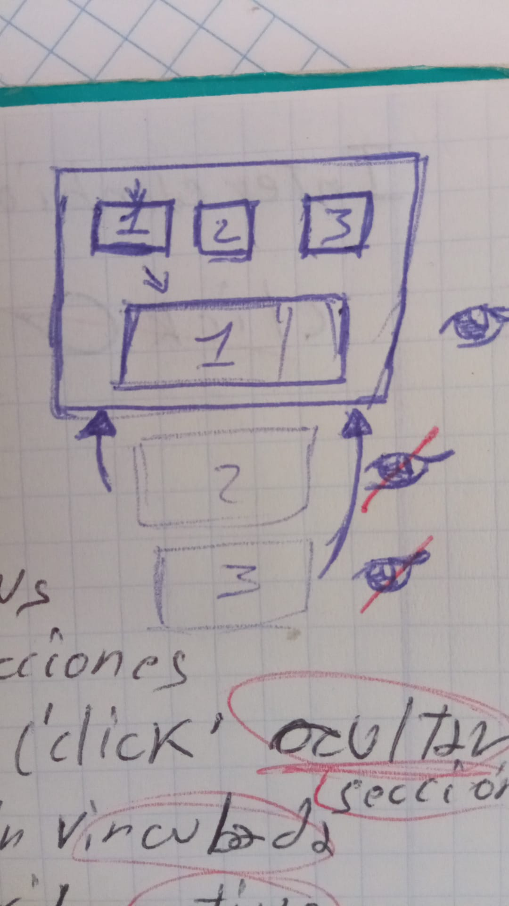
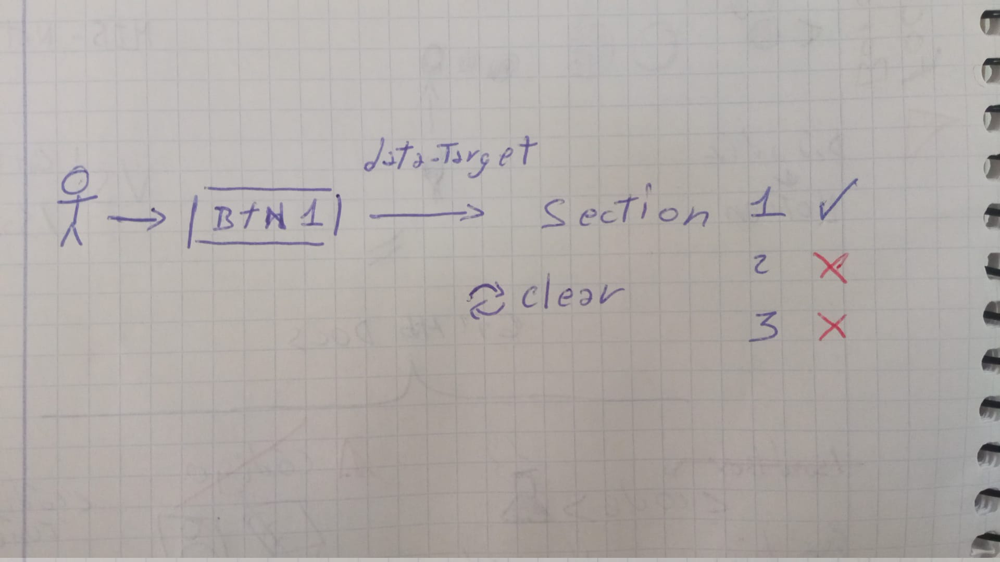

# Lógica: Animaciones CSS / CANVAS / SVG
Trabajo 3 tipos de animaciones web.

1. CSS (Transformaciones, Transiciones, Animaciones (@Keyframes))
2. CANVAS => js
3. SVG => html

## Imagen de contexto
;

## Diagrama de comportamiento.
;

## Stack
- HTML
- CSS
- JS

## Trucos:
**canvas** Genera un lienzo para dibujar en el mediante JS.
